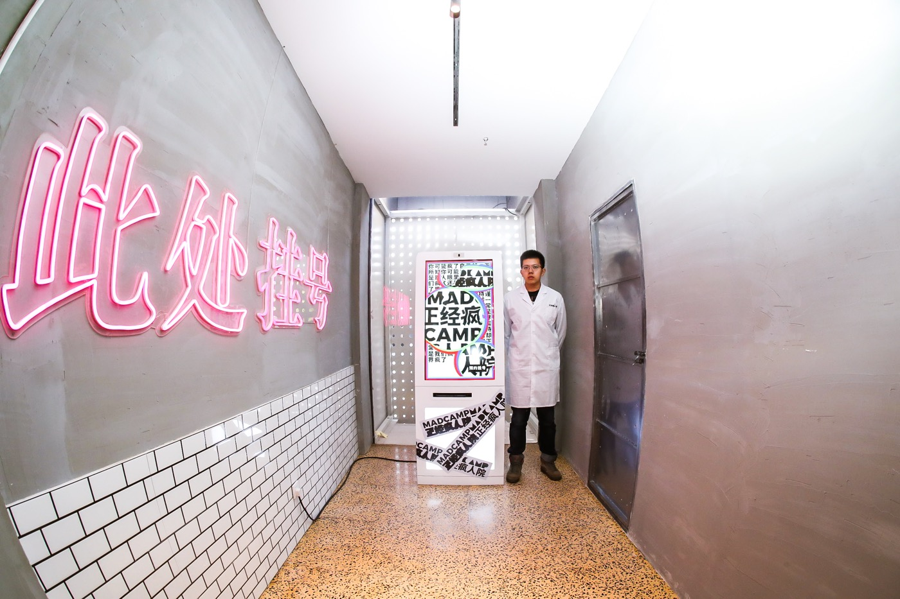
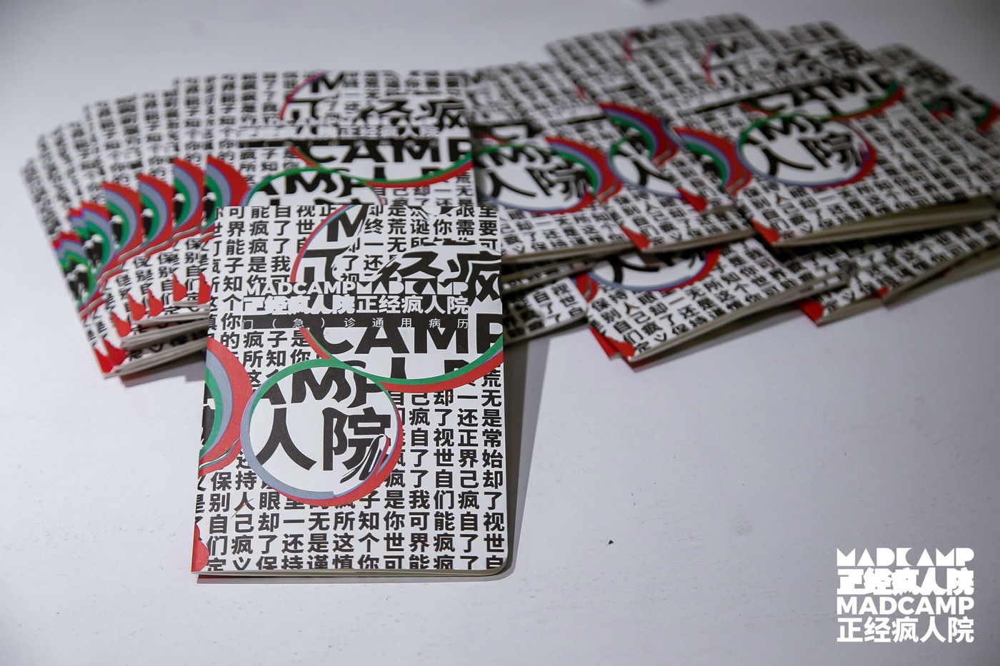
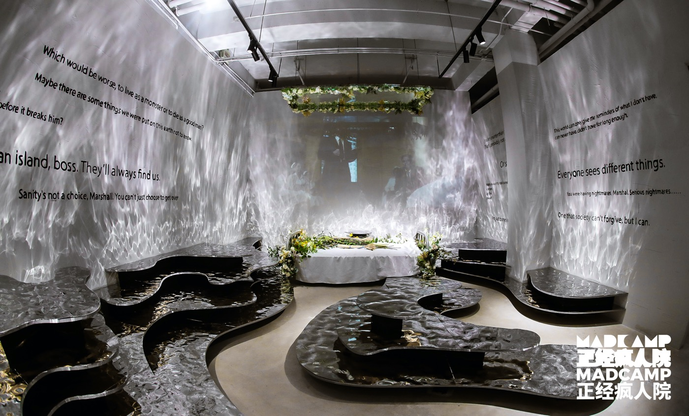
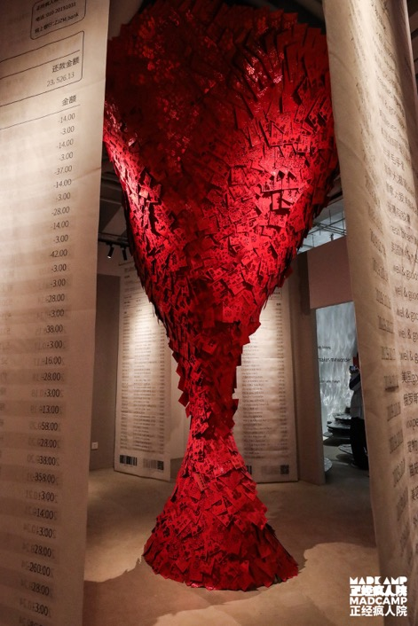
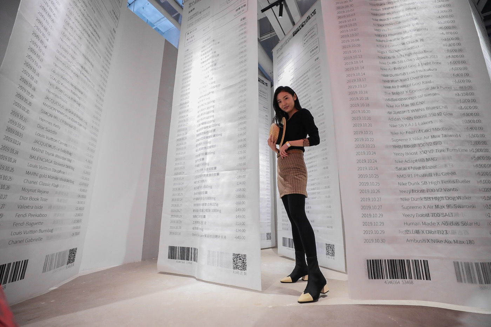
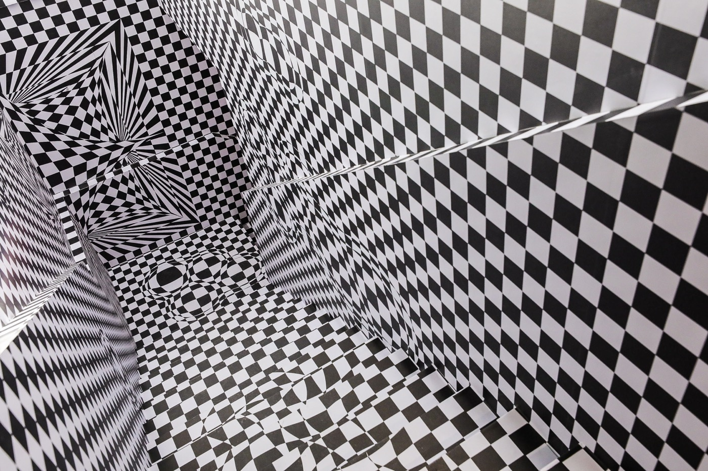
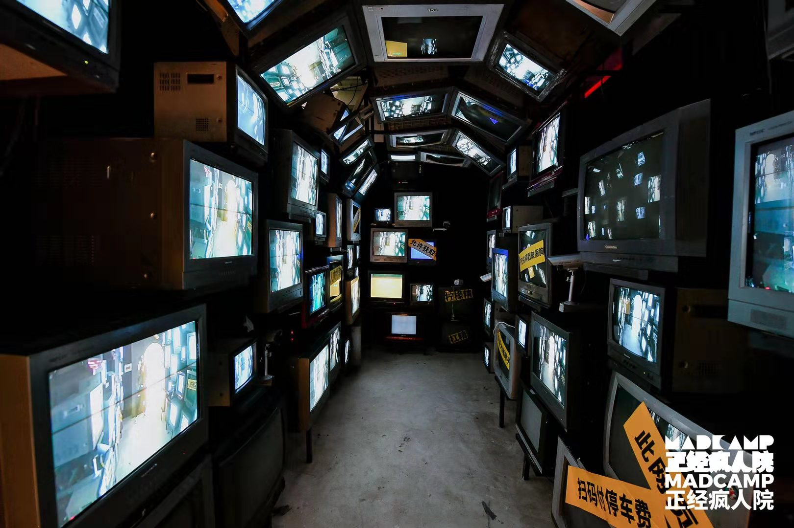
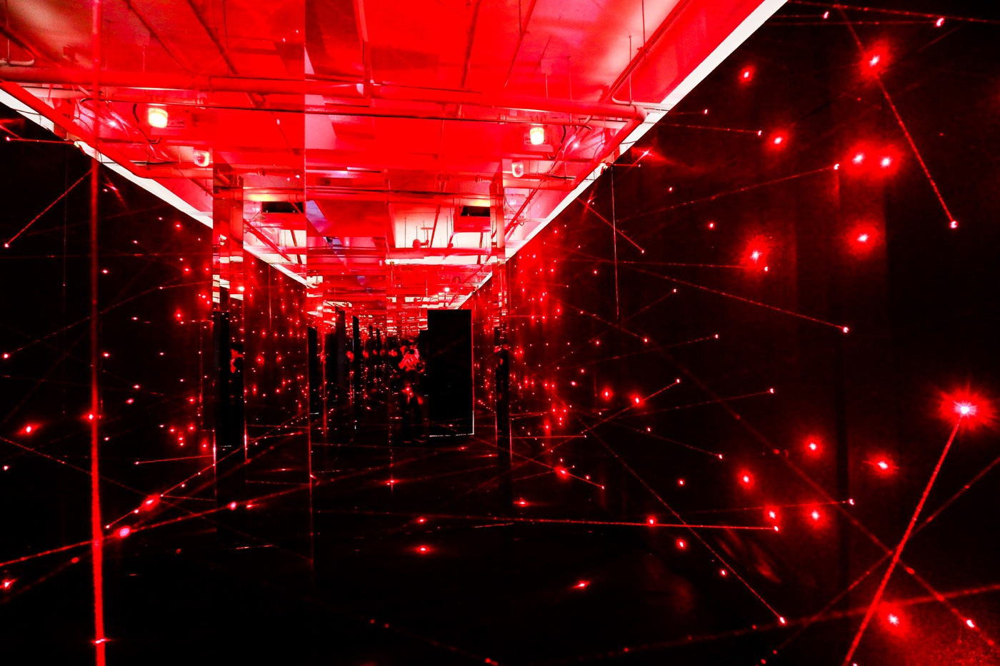
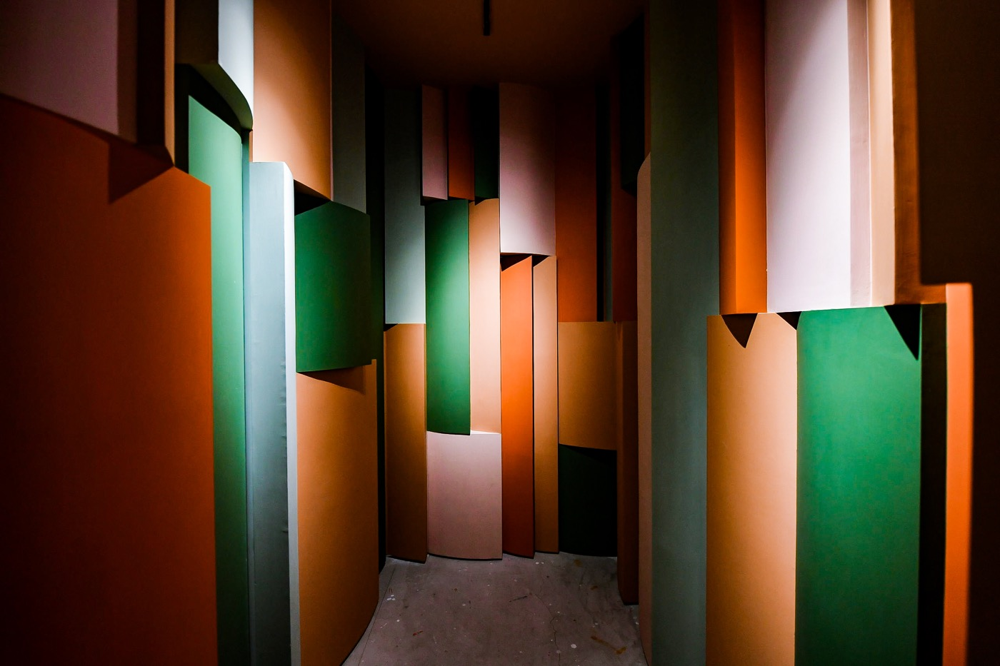
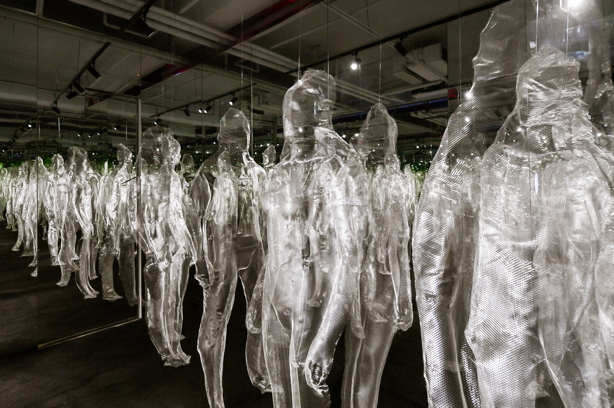

# Part-time-Job
- 背景
```
「正经做梦」是一家以沉浸式场景 IP 为核心的创意厂牌。
厂牌
由一群
拥有全球视野及潮流敏锐度的
艺术家、建筑师、设计师和媒体人
集结而成，
以
生活细节作为展览的灵感来源
来结合当下热门社会议题，
通过
年轻潮流的视觉语言
呈现给所有热爱做梦的人。

19年10月31日，
创意厂牌「正经做梦」为帝都带来
又一场沉浸式主题大展————「正经疯人院」。
其
北京分院在工体西门内 GONGTI PARK-A05 
的
新兴潮流艺术地标「正经中心做梦」正式开幕。

自19年11月1日，「正经疯人院」正式向公众开放。
```

- 立意
```
「正经疯人院」的创立
源于
对当今社会中许多无处安放的潜在「疯」陷的洞察。
怀着
「 It is ok to not be ok」
的开放态度
和
对都市年轻人心理状况的关注。

「正经疯人院」
以
「不诊断、不束缚、不治疗」
为办院理念，
提供自我发现和相互接纳的新视角。

500 平方米的独幢复式空间，
「多梦症」、「欲望胶囊」、「中贰药房」
等 20 个全面升级的
全感官诊疗项目（包括 8 个首次问世的专利场景），
第一人称的沉浸式故事体验、
多维度的互动方式、
以毒攻毒、
比你更疯的「医生」、
同病相怜、相见恨晚的「病友」
......

在这里，
你
将有机会
重新认识
不一样的自己、
感受不一样的他人。
让
我们一起完成一场
自我发现、自行诊断、自我疗愈
的过程吧。
```

# 2020-03 - 正经疯人院（北京工人体育场）
- 挂号
```
会有拍照的环节
```


- 病历本
```
会有张卡片，把卡片贴到病历本的第一页
```


- 宣泄
```
像是
被困在室内的大海，
被困在海面的空病床。
床边鲜花簇拥，像是在缅怀人的无枝可栖的理智。

场景灵感源于电影「禁闭岛」尾声令人深思的台词：
像野兽般混沌地活着，还是像自己一样清醒地死去。

躺在孤舟般的床上，
看着穹顶镜子里的自己，
回忆一遍遍地过，
感受着
生而为人、限止于人
的混沌和清醒。
```


- 节日压力
```
节日总是
喜忧参半的，
拔地而起
的
红包龙卷风
呈现节日对都市年轻人的压迫感，
也
带来解开
亲人间心结的
小惊喜。

仔细寻找，
你将会心一笑。

```


- 账单压力
```
人生苦短，
「即时消费主义」
主宰着一切。
在消费和数字的时代，
人们购买的不再是
简单的某件东西，
而是某个人设和体验。
```


- 视错觉
```
空间
将
著名几何学悖论
的
二维彭罗斯阶梯
以
三维的方式呈现，
让
你在触感和视觉错乱的双重冲击下，
充分体会
被
多重感官欺骗的不可思议。
```



- 隐私直播
```
人们
在
网络世界找寻身份认同感的同时，
任何个人隐私都可能随时
成为赤裸的公有信息。
无数小屏幕里，
和粹不及防的自己面面相觑。
在隐私直播，曝光你的被曝光，
让你此刻的窘迫无措
成为一种杜绝隐私泄漏的提醒。
```


- 打结的人际关系
```
剪不断，理还乱？
那是你的身段不够软！
此诊疗项目专业开发
「液体人类」潜质，
打造游刃于红外线警报网的人际特工。
```


- 选择门
```
类似于互动视频，
一个过渡的环节，
两扇门通往不同的场景
```



- 社交恐惧
```

```



- SweetVille
```

```

- 多梦症
```

```

- 马桶恐惧症
```

```

- AB面
```

```

- 键盘侠
```

```

- FOMO
```

```

- 忏悔
```

```

- 欲望胶囊
```
海洋球
```

- 中贰药房
```
调酒
```


